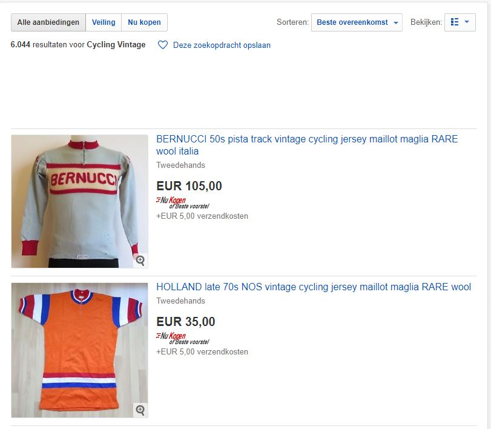
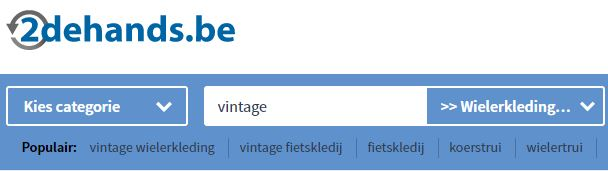
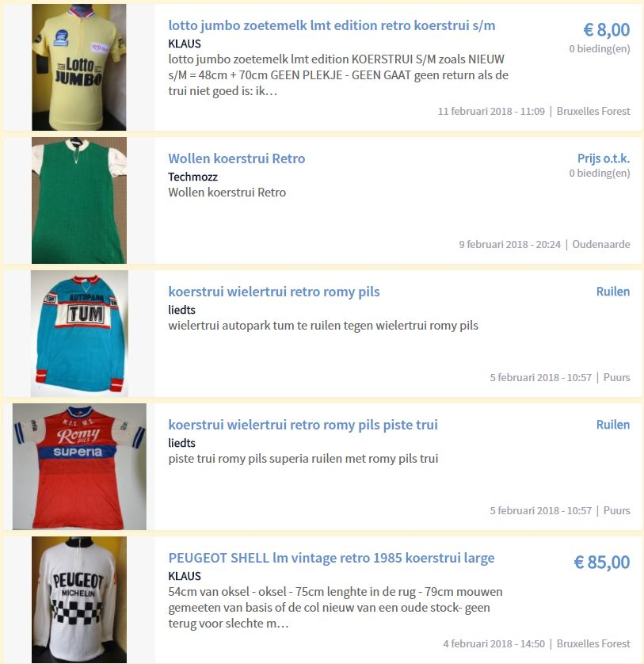
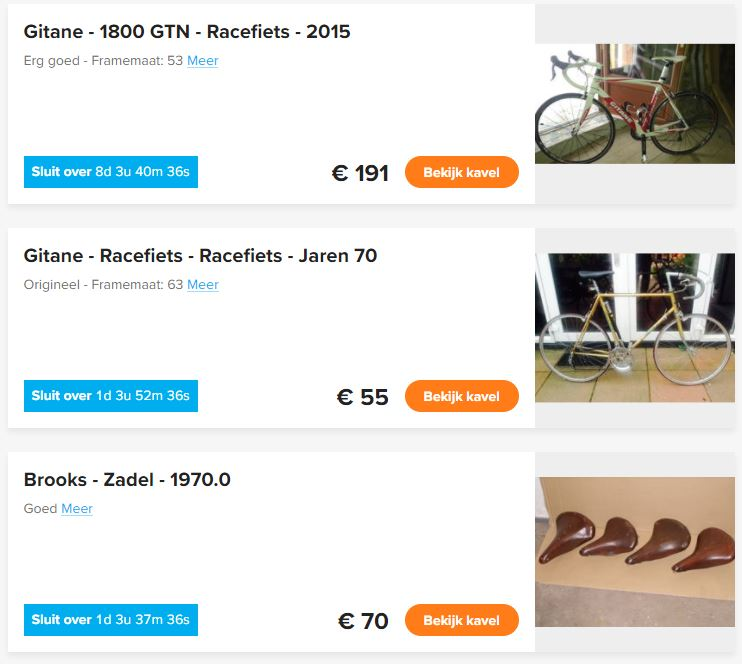
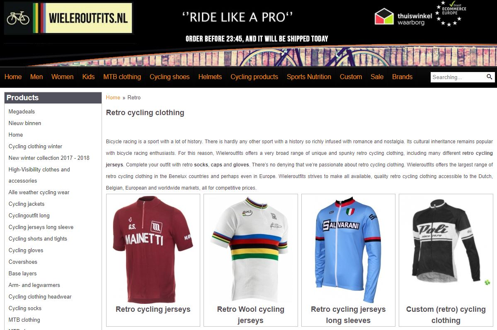
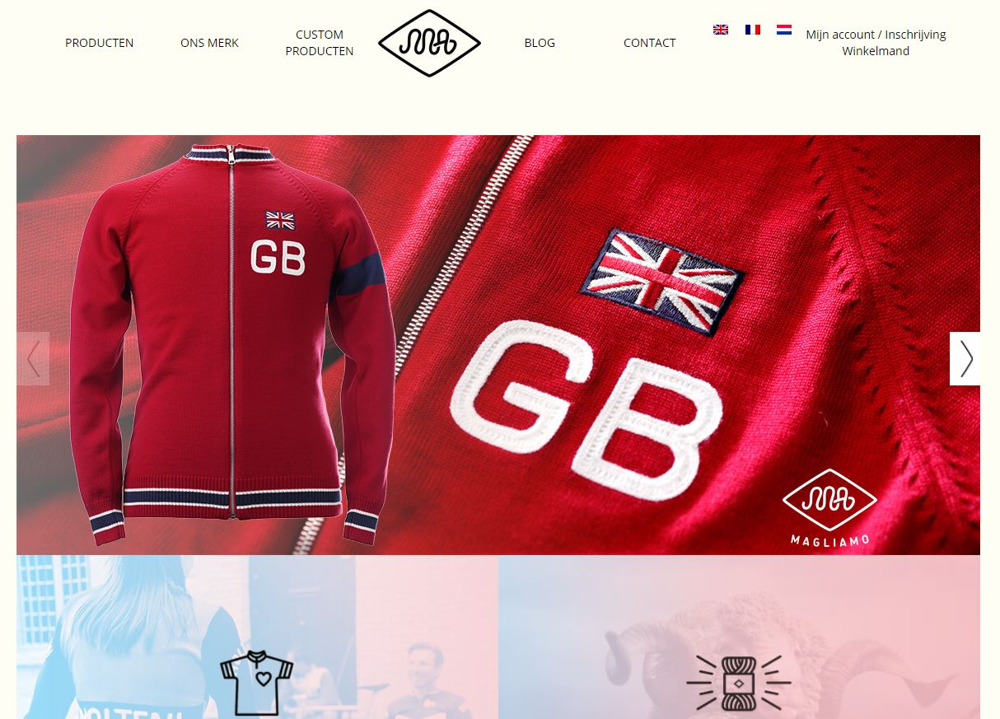
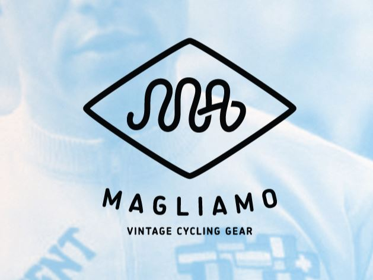

## Concurrentie Analyse: 

### Zeer grootschalige websites: 

#### Ebay :  
[Ebay](https://www.benl.ebay.be/) is één van de meest bekend voorbeelden van een veilingsplatform
Op ebay kan je ook oud koersmateriaal kopen.

Cycling vintage clothes:  

#### 2dehands.be : 
Op [2dehands.be](https://www.2dehands.be/) kan je ook retro koerskledij en koerstruitjes vinden
Koerstruitjes:  

{:.hands}

{:.hands}

#### catawiki.be 
Op [catawiki](https://www.catawiki.be/) kan je ook nieuwe of oude fietsen kopen
Wat ik goed vind aan deze website zijn de timers.
Dit is omdat de website voor veilingen is  

### Websites meer specifiek voor wielerkledij: 

#### Wieleroutfits.nl 
Retro cycling clothing:

Bij [wieleroutfits.nl](https://www.wieleroutfits.nl/) kan je alle soorten fietskledij kopen retro of moderne kledij.

#### Magliamo Cycling gear 

[Magliamo](https://www.magliamo.be/nl/) is vooral gespecialiseerd in het verkopen van vintage wielrenners kledij
Er is ook de mogelijkheid om je eigen truitjes te laten ontwerpen
Ze hebben ook een zeer mooie website. Deze website vind ik een zeer mooi voorbeeld 
hoe ik de mijne zou willen.

Zoals u kunt zien zijn er veel websites waar je collectors items en vintage item van het wielrennen 
kan kopen. 
Dus er is zeker nog interesse in dit product.